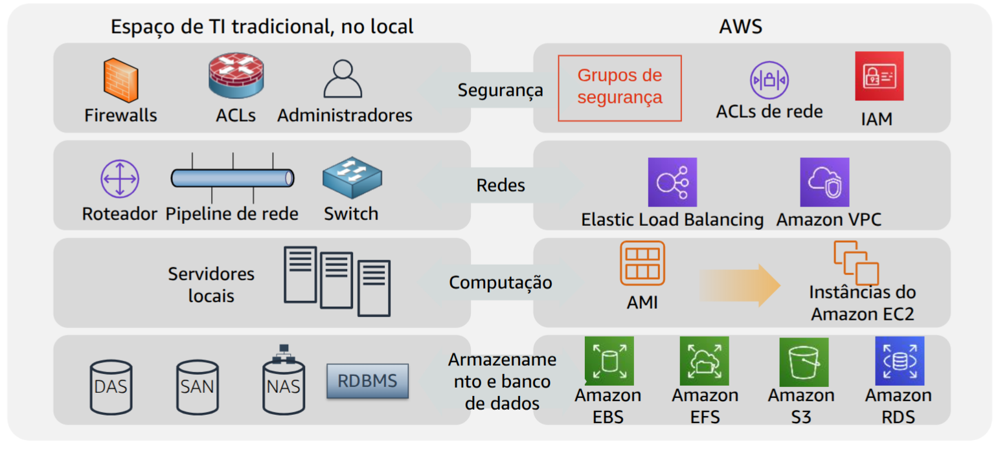
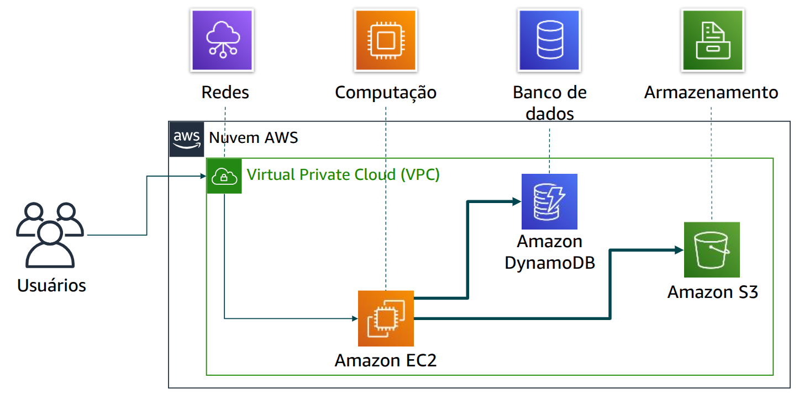
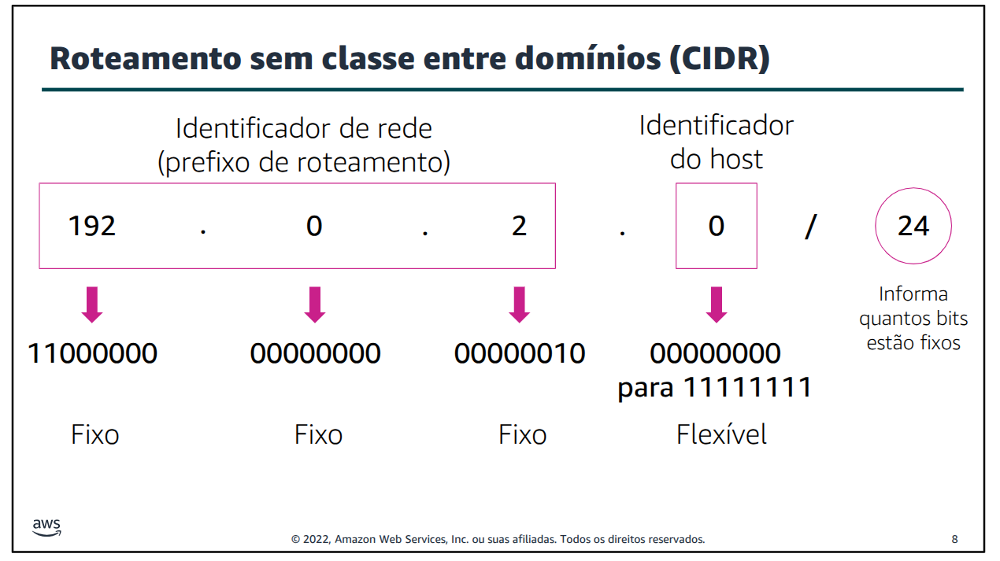
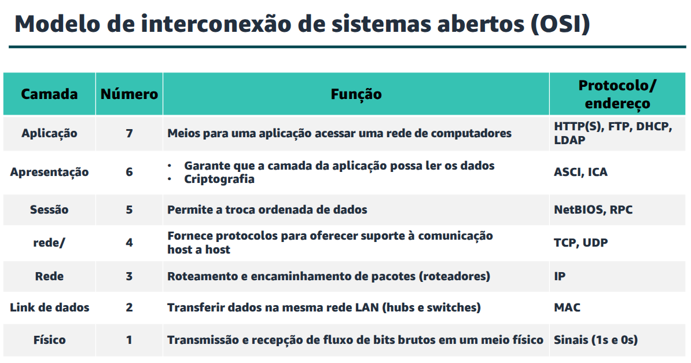
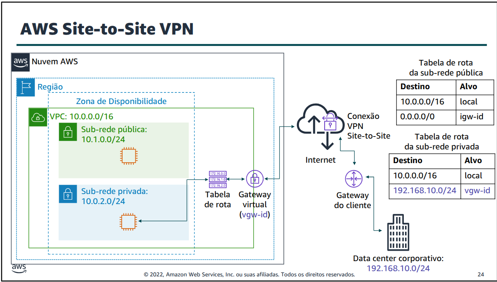
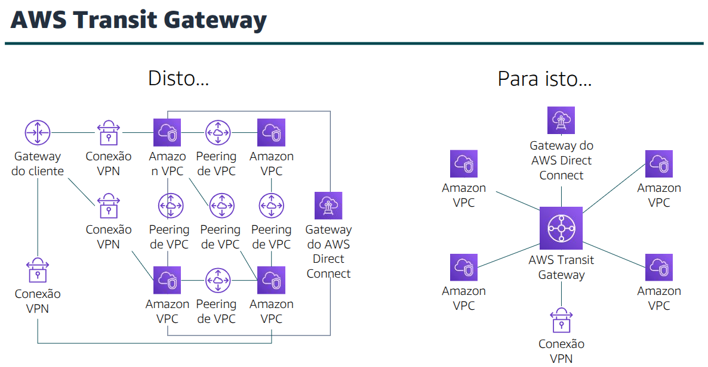
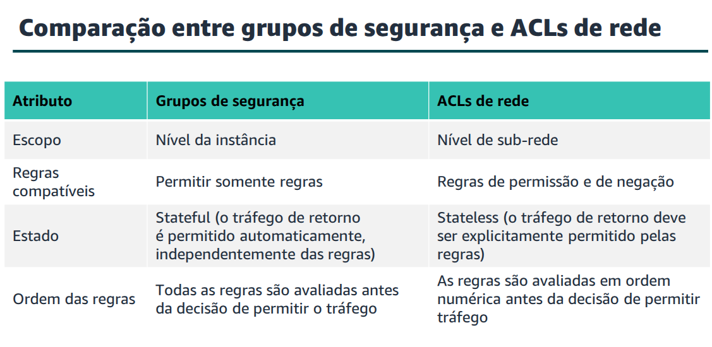

# Módulo 1 - Cloud Concepts

### Cloud Computing Definition
Cloud computing is the on deman delivery of IT resources (compute power, database, storage, applications, etc) via internet with pay-as-you-go pricing.

It allows for us to think and use infrastructure as software instead of hardware.

- **Infraestrutura como serviço (IaaS):** os serviços nesta categoria são os componentes básicos da TI em nuvem e, geralmente, fornecem acesso (virtual ou no hardware dedicado) a recursos de rede e computadores, bem como espaço para o armazenamento de dados. A IaaS oferece o mais alto nível de flexibilidade e controle de gerenciamento sobre seus recursos de TI. É o modelo mais semelhante aos recursos de TI existentes com os quais muitos departamentos e desenvolvedores de TI já estão familiarizados.

- **Plataforma como serviço (PaaS):** os serviços nessa categoria reduzem a necessidade de gerenciar a infraestrutura subjacente (geralmente hardware e sistemas operacionais) e permitem que você se concentre na implantação e no gerenciamento de seus aplicativos.

- **Software como serviço (SaaS):** os serviços nesta categoria fornecem um produto completo que o provedor de serviços executa e gerencia. Na maioria dos casos, o software como serviçorefere-se a aplicativos de usuário final. Com uma oferta de SaaS, não é necessário pensar na manutenção do serviço ou no gerenciamento da 
infraestrutura subjacente. É necessário pensar apenasem como você planeja usar esse software específico. Um exemplo comum de aplicação do SaaS é o webmail, no qual você pode enviar e receber e-mails sem precisar gerenciar recursos adicionais para o produto de e-mail nem manteros servidores e sistemas operacionais no qual o programa de e-mail está sendo executado

### Web Service

A web service is any software avaliable on the internet that uses a standardized format, such as Extensible Markup Language (XML) or JavaScript Object Notation (JSON), for requesting and responding through a Aplication Programming Interface (API).
It's not attached to a operational system or programming language. 
It is detectable and self-descriptive through an interface definition file.

#### Example of a simple solution 

- **EC2** - Instances of Amazon Elastic Compute Cloud running the application.
- **S3** - Adding object to Amazon Simple Storage Service.
- **DynamoDB** - Create indexes that allow you to find all objects of a client using Amazon DynamoDB.
- **VPC** - All the services are running inside a Amazon Virtual Private Cloud

# Módulo 3 - AWS Global Infrastructure

A AWS Region is a geographic location and usualy consists of two or more Avaliability Zones.

We should consider a few factors when selecting a Region:
- Legal requirements (laws)
- Proximity with customers (latency)
- Availble services for the region
- Costs (it may vary from Region to Region)

### Availability Zone
Each Region has multiple AZs
Avaliabilty Zones consists of multiple distincts Data Centers
Are projected for isolating failures and are interconected to other avaliability zones.

### Presence Points
Amazon CloudFront is a CDN (Content Delivery Network) used to distribute content to end user at a low latency.
Amazon Route 53 is a DNS (Domain Name Service) that routes any requests to the nearest presence point
Edge Locations and Regional Edge Caches improve performance by caching content in locations closer to users.

***

AWS Global Infrastrucutre can be broken down into 3 elements:
- Regions
- Avaliability Zones
- Points of Presence (which include Edge Locations)

This infrastructure provides the platform to network, compute, storage and database services.

#### Storage Services
- Amazon S3 (Simple Storage Service)
- Amazon EBS (Elastic Block Storage)
- Amazon EFS (Elastic File System)

#### Compute Services
- Amazon EC2 - Virtual Machines
- Amazon EC2 Auto Scaling
- Amazon ECS (Elastic Container Service) - Container Orchestration 
- Amazon EC2 Container Registry - Docker container images
- AWS Elastic Beanstalk 
- AWS Lambda
- Amazon EKS (Elastic Kubernetes Service)
- AWS Fargate

#### Database Services
- Amazon RDS (Relational Database Service)
- Amazon Aurora
- Amazon Redshift
- Amazon DynamoDB

#### Networking and Content Delivery Services
- Amazon VPC (Virtual Private Cloud)
- Amazon ELB (Elastic Load Balacing)
- Amazon CloudFront
- AWS Transit Gateway
- Amazon Route 53
- AWS Direct Connect
- AWS VPN 

#### Security, Identity and Complicance Services
- AWS IAM (Identity and Access Management)
- AWS Organizations
- Amazon Incognito
- AWS Artifact
- AWS KMS (Key Management Service)
- AWS Shield

#### Cost Management Services
- AWS Cost and Usage Report
- AWS Budgets
- AWS Cost Explorer

#### Management and Governance Services
- AWS Management Console
- AWS Config
- Amazon CloudWatch
- AWS Auto Scaling
- AWS CLI 
- AWS Trusted Advisor
- AWS Well-Architected Tool
- AWS CloudTrail

# Módulo 4 - AWS Cloud Security

AWS is responsible for the security **OF** the cloud while
clients are responsible for the security **IN THE** cloud

Infrastructure as a Service (IaaS): client is responsible for the security of the resources
- Amazon EC2
- Amazon EBS
- Amazon VPC

Platform as a Service(Paas): AWS is responsible for the security 
- AWS Lambda
- Amazon RDS
- AWS Elastic Beanstalk

## AWS Identity and Access Management (IAM)

There are four IAM components
- User: person or aplication that is allowed to access the AWS account. Each user must have a unique login (name and password).
- Group: efficiency mechanism to apply permissions.
- Policy: document which defines access to one or more services. Policies are create independently of users and groups.
- Role: mechanism for granting temporary access to services.

#### Types of access
- Programatic Access: the user must present a key pair (access key ID and secret access key).
- Management Console Access: the user must at least fill their name and password. If multifactor authentication they would also be asked for the MFA code.

#### Authorization: 
The process of determining the permissions a user, service or application should be granted.

#### IAM Policy
Is a document writen in JSON (JavaScript Object Notation) that lists the permissions that allow or deny access to services.
- Identity based policies: can be attached to and entity (user, group or role)
- Resource based policies: attached to a resource

# Módulo 5 - Networking and Content Delivery

A compute network is two or more machines that are connected together in order to communicate. A network can be logically partitioned into subnets.

Each machine in a network has an unique IP (Internet Protocol) addres assigned to it.

- IPv4 - 32 bits
- IPv6 - 128 bits

### CIDR - Classless Inter-Domain Routing

A common method to describe networks and groups of IP addresses is Classless Inter-Domain Routing (CIDR).

A CIDR address is expressed as an IP address as follows:

- An IP address (the first address of the network)
- Followd by a slash (/) character
- FInally, the number after the slash (/) character that tells how many bits of the routing prefix must be steady and allocated for the network identifier. The bits that are not fixed, are allowd to change.

CIDR is a way to express a group of IP addresses that are consecutive to each other. 

In this example there are 256 IP addresses avaliable for the network, ranging from 192.0.2.0 to 192.0.2.255

### OSI - Open System Interconnection

The OSI model is a conceptual model that is used to explain data as it travels over a network. It consists of seven layers and it shows the common protocolos and addresses that are used to send data at each layer.

## Amazon VPC
Amazon Virtual Private Cloud is a service that let us provision a logically isolated section of the AWS cloud.

- Selection of IP address range
- Creation of subnets
- Configuration of route tables and network gateways

- Public subnet: have access to the internet
- Private subnet: DO NOT have access to the internet

### Reserved IP addresses
When creating a subnet, it requires it's own CIDR block. For each block, AWS reserves five IP addresses. These are not avaliable.

- 10.0.0.0: Network Address
- 10.0.0.1: VPN local routing
- 10.0.0.2: DNS Resolution
- 10.0.0.3: Future usage
- 10.0.0.255: Network Broadcast Address

### Route Table
Contains a set of rules, called routes, that directs network traffic to and from the subnet. Each route specifies a destination and a target.

Desination is the CIDR block that you want the traffic to go.
The target is the processing resource that the traffic is send through.

Each subnet in a VPC must be associated with a route table.

RESUMO:
Algumas das principais lições desta seção do módulo são:
- Uma VPC é uma seção isolada logicamente da Nuvem AWS.
- Uma VPC pertence a uma região e requer um bloco CIDR.
- Uma VPC é subdividida em sub-redes. 
- Uma sub-rede pertence a uma zona de disponibilidade e requer um bloco CIDR.
- As tabelas de rotas controlam o tráfego de uma sub-rede. 
- As tabelas de rotas têm uma rota local integrada.
- Você adiciona outras rotas à tabela.
- Não é possível excluir a rota local.

## Internet Gateway
A Internet Gateway is a sacalable, redundant and highly available VPC component that allows communication between instances and the public internet. 

It serves two purposes:
- To provide a target in VPC route tables for internet traffic
- Perform network addresses translations for instances that were assgined public IPv4 addresses.

To make a sub-net public, attach a internet gateway to the VPC and add a route entry to the route table associated with the subnet.

## NAT Gateway
A network Address Translation (NAT) Gateway enables instances in a private subnet to connect to the internet or other AWS services while preventing the public internet from initiating a connection with those instances.

### AWS Transit Gateway
The Transit Gateway acts as a hub that controls how the traffic is routed between all connected VPCs.

### Security Groups
A Security Group acts as a virtual firewall, controlling the inbound and outbound traffic of instances. They act in the instance level and not in the subnet level.

They filter traffic to and from the instances.

When you create a Security Group, it does not have an inbound rule. 
It does not allow any inbound traffic.

In the other hand, it also includes by default a rule that allows all outbound traffic. 

Security Groups are stateful.

### Network Access Control List (Network ACL)
A Network ACL work at the subnet level and control traffic in and out of the subnet.

They are stateless, meaning no information about a request is mantain after a request is processed.

All subnets must be associated with a Network ACL. If no associations is explicitly made, a default ACL will be assgined. 

You can associate the same ACL to multiple subnets. But one subnet can have one and only one ACL associated with it.

## Amazon Route 53
Amazon Route 53 is a highly avaliable and scalable Domain Name System web service.

## Amazon CloudFront
Amazon CloudFront is a Content Delivery Network (CDN) Service. 