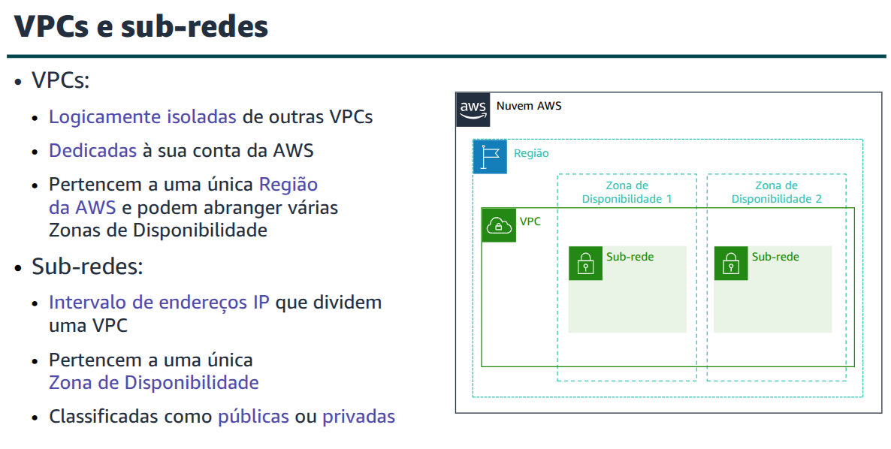
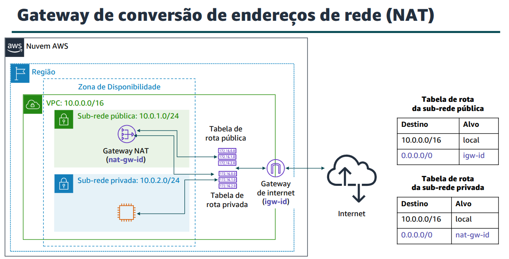

# Módulo 5 - Networking and Content Delivery

A compute network is two or more machines that are connected together in order to communicate. A network can be logically partitioned into subnets.

Each machine in a network has an unique IP (Internet Protocol) addres assigned to it.

- IPv4 - 32 bits
- IPv6 - 128 bits

### CIDR - Classless Inter-Domain Routing

A common method to describe networks and groups of IP addresses is Classless Inter-Domain Routing (CIDR).

A CIDR address is expressed as an IP address as follows:

- An IP address (the first address of the network)
- Followd by a slash (/) character
- FInally, the number after the slash (/) character that tells how many bits of the routing prefix must be steady and allocated for the network identifier. The bits that are not fixed, are allowd to change.

CIDR is a way to express a group of IP addresses that are consecutive to each other. 

In this example there are 256 IP addresses avaliable for the network, ranging from 192.0.2.0 to 192.0.2.255

### OSI - Open System Interconnection

The OSI model is a conceptual model that is used to explain data as it travels over a network. It consists of seven layers and it shows the common protocolos and addresses that are used to send data at each layer.

## Amazon VPC
Amazon Virtual Private Cloud is a service that let us provision a logically isolated section of the AWS cloud.

- Selection of IP address range
- Creation of subnets
- Configuration of route tables and network gateways

- Public subnet: have access to the internet
- Private subnet: DO NOT have access to the internet

### Reserved IP addresses
When creating a subnet, it requires it's own CIDR block. For each block, AWS reserves five IP addresses. These are not avaliable.

- 10.0.0.0: Network Address
- 10.0.0.1: VPN local routing
- 10.0.0.2: DNS Resolution
- 10.0.0.3: Future usage
- 10.0.0.255: Network Broadcast Address

### Route Table
Contains a set of rules, called routes, that directs network traffic to and from the subnet. Each route specifies a destination and a target.

Desination is the CIDR block that you want the traffic to go.
The target is the processing resource that the traffic is send through.

Each subnet in a VPC must be associated with a route table.

RESUMO:
Algumas das principais lições desta seção do módulo são:
- Uma VPC é uma seção isolada logicamente da Nuvem AWS.
- Uma VPC pertence a uma região e requer um bloco CIDR.
- Uma VPC é subdividida em sub-redes. 
- Uma sub-rede pertence a uma zona de disponibilidade e requer um bloco CIDR.
- As tabelas de rotas controlam o tráfego de uma sub-rede. 
- As tabelas de rotas têm uma rota local integrada.
- Você adiciona outras rotas à tabela.
- Não é possível excluir a rota local.

## Internet Gateway
A Internet Gateway is a sacalable, redundant and highly available VPC component that allows communication between instances and the public internet. 

It serves two purposes:
- To provide a target in VPC route tables for internet traffic
- Perform network addresses translations for instances that were assgined public IPv4 addresses.

To make a sub-net public, attach a internet gateway to the VPC and add a route entry to the route table associated with the subnet.

## NAT Gateway
A network Address Translation (NAT) Gateway enables instances in a private subnet to connect to the internet or other AWS services while preventing the public internet from initiating a connection with those instances.

### AWS Transit Gateway
The Transit Gateway acts as a hub that controls how the traffic is routed between all connected VPCs.

### Security Groups
A Security Group acts as a virtual firewall, controlling the inbound and outbound traffic of instances. They act in the instance level and not in the subnet level.

They filter traffic to and from the instances.

When you create a Security Group, it does not have an inbound rule. 
It does not allow any inbound traffic.

In the other hand, it also includes by default a rule that allows all outbound traffic. 

Security Groups are stateful.

### Network Access Control List (Network ACL)
A Network ACL work at the subnet level and control traffic in and out of the subnet.

They are stateless, meaning no information about a request is mantain after a request is processed.

All subnets must be associated with a Network ACL. If no associations is explicitly made, a default ACL will be assgined. 

You can associate the same ACL to multiple subnets. But one subnet can have one and only one ACL associated with it.

## Amazon Route 53
Amazon Route 53 is a highly avaliable and scalable Domain Name System web service.

## Amazon CloudFront
Amazon CloudFront is a Content Delivery Network (CDN) Service. 