# Module 6 - Compute

AWS compute services covered in this module:
- **Amazon Elastic Compute Cloud (Amazon EC2)** provides resizable virtual machines 
- **Amazon EC2 Auto Scaling** support application avaliability, allowing the definition of conditions that will automatically launch or terminate EC2 instances. 
- **Amazon Elastic Container Registry (Amazon ECR)** is used to store and retrieve Docker images.
- **Amazon Elastic Container Service (Amazon ECS)** is a container orchestration service that supports Docker.
- **VMware Cloud on AWS** enables to provision a hybrid cloud without custom hardware.
- **AWS Elastic Beanstalk** provides a simple way to run and manage web applications.
- **AWS Lambda** is a serverless compute solution.
- **AWS Elastic Kubernetes Service (Amazon EKS)** enables to run managed Kubernetes on AWS
- **Amazon Lightsail** provides a simple to use service for building an application or website
- **Amazon Batch** provides a tool for running batch jobs at any scale
- **Amazon Fargate** provides a way to run containers that reduce the need for managing servers or clusters
- **AWS Outposts** provides a way to run select AWS services on premises datacenters.
- **AWS Serverless Application Repository** provides a way to discover, deploy and publish serverless applications.

--- 

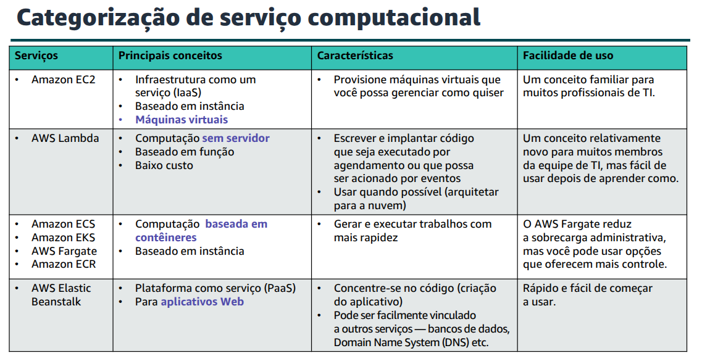

## Amazon EC2
Amazon EC2 provides **Virtual Machines (VMs)** in the cloud. These VMs are refered to as **EC2 instances**. 

Instances are launched from **Amazon Machine Images (AMIs)** which are effectively virtual machine templates.

You can control traffic to and from these instances by using security groups.

These are the nine key decisions that must be made when launching an EC2 Instance

1. AMI
2. Instance Type
3. Network Configuration
4. IAM Role
5. User Data
6. Storage Options
7. Tags
8. Security Groups
9. Key Pairs

### 1. AMI (Amazon Machine Images)
AMIs are templates used to create an EC2 instance (which is a Virtual Machine).

They contain a Operating System and will often have additional software pre-installed.

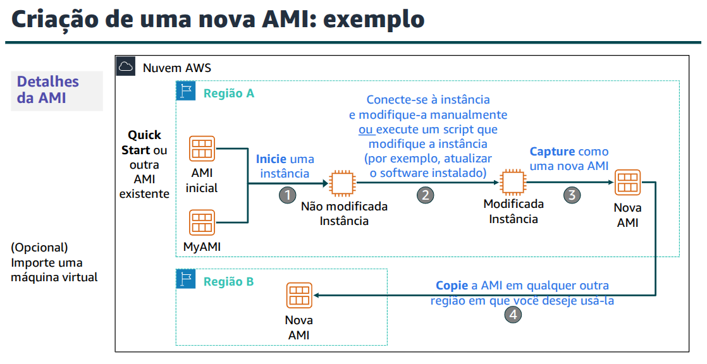

### 2. Instance Type
How would the EC2 instance that you create be used?

Instance types can be optimized for different use cases. They reflect combinations of CPU, memory, storage and network capacity.

Resources:
- Memory (RAM)
- Processing power (CPU)
- Disk type and disk storage (storage)
- Network performance capabilities

Instance types categories:
- General purpose
- Compute optimize
- Memory optimize
- Storage optimize
- Accelerated computing 

Instance types offer *family*, *generation* and *size*.

A instance type name is comprised of three parts. For instance, consider the T type ***t3.large***
- **T** is the family
- **3** is the generation 
- **Large** is the size

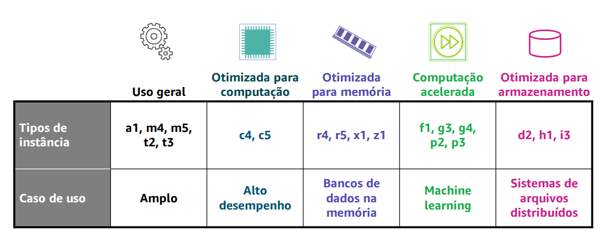

### 3. Network Configuration 
After choosing an AMI and Instance type, we need to specify the network location where the EC2 instance will be deployed.

Select the Region, the VPC and the subnet where the EC2 instance will be deployed. 

When initiating an instance using a default VPC, AWS will give it a public IP by default. 
When running an instance in a custom VPC, the subnet has an attribute that determines if instances will have a public IP address.

### 4. IAM Role
AWS allows us to create and attach an IAM role to the EC2 instance. 

We should **never** store AWS credentials on an EC2 instance.
Instead, attach an IAM role to the EC2 instance.

An **instance profile** is a container for an IAM role. 

### 5. User Data
When creating an EC2 Instance, we have the option of passing **user data** to the instance. 

User data can automate the completion of instalations and configurations at instance launch.

By default, user data only runs the first time that an instance starts ups.

User data scripts can be used to reduce the number of custom AMIs that we need to build and mantain. 

### 6. Storage Options
When launching an EC2 instance, we can configurate the storage options.
For example, the size of the root volume where the guest operating system is installed.

We can also attach aditional storage volumes. Some AMI are configured to launch more than one storage volume by default to provide storage options that are separate from the root volume.

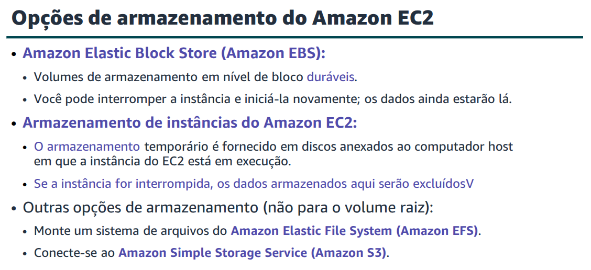

### 7. TAGs
A TAG is a label that can be assigned to an aws resource. Each tag consist of a *key* and a optional *value*.

Tagging is how we can attach metadata to an EC2 instance.

### 8. Security Group
A **security group** acts as a **virtual firewall** that controls network traffic for one or more instances. 

We can add **rules** to each security group. Rules allow traffic to or from it's associated instances.

When defining a rule, we can specify the allowable source of the network communication, inbound rules, or destination, outbound rules.

The source can be an IP address, IP address range, another security group, VPC, endpoint or anywhere.

By default, a security group includes an outbound rule that allows all outbound traffic. 

### 9. Key pairs
A **Key Pair** consists of a **public key** and a **private key**.
It enables secure connections to an EC2 instance. 

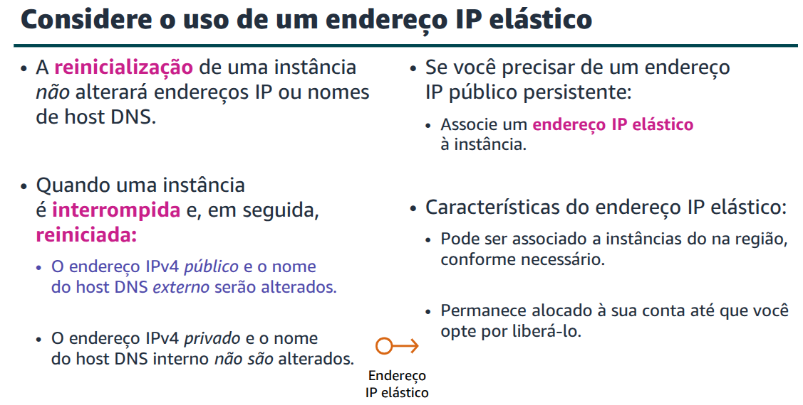

## EC2 Cost Optimization

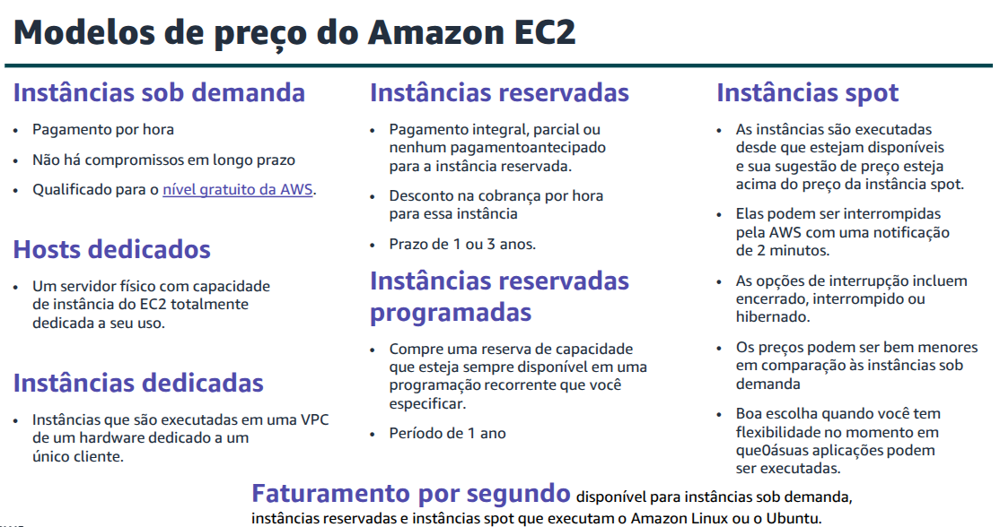

Benefits of each pricing model

- **On demand instances** offer low cost and flexibility with no long term contract
- **Spot Instances** provide large scale at discounted price
- **Reserved Instances** are good for predictability and steady state compute needs
- **Dedicated Hosts** are a good choice when you have licensing restrictions or need to meet compliance or regulatories requirements.

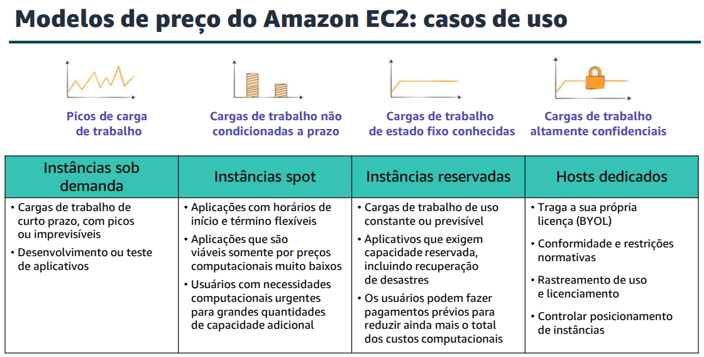

### The Four Pillars of Cost Optimization

- **Right Size**: choose the right balance of instance types. 
- **Increase Elasticity**: reduce the amount of idle service capacity by implementing elastic deployments with the use of automatic scalig to handle peak loads.
- **Choose optimal pricing**: choose the best pricing option for your current usage patterns.
- **Optimize storage choices**: reduce unsused storage and choose less expensive storage options.

## AWS Container Services

### Containers

**Containers** are a method of **operating system virtualization**.

Containers are smaller than Virtual Machines (VMs) and DO NOT contain an entire operating system. Instead, they SAHRE a vritualized operating system and run as resource isolated processes.

### Docker
**Docker** is a software platform that packages software, such as applications, into containers.

Containers have everything that an application needs including: 
- Libraries
- System tools
- Application code
- Runtime libraries

#### Container vs Virtual Machine 
A key difference between Containers and Virtual Machine is that VMs run directly on a hypervisor while containers run on any operating systems that have the appropriate kernel features to support docker host software.

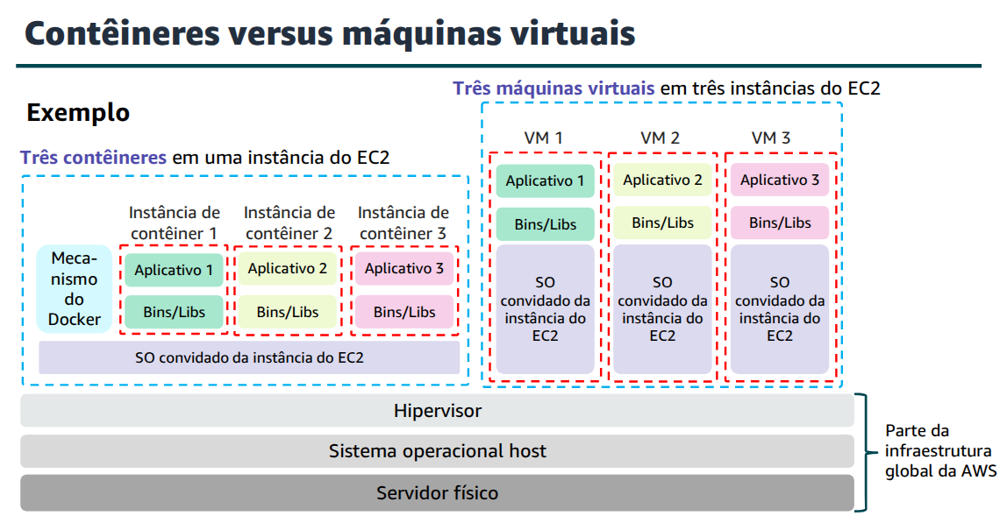

### Amazon Elastic Container Service (ECS)
**Amazon ECS** is a highly scalable and fast **container management service**.

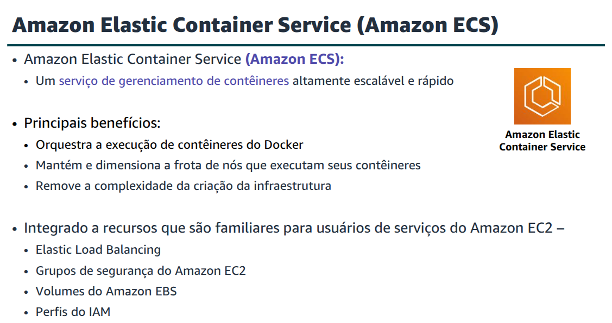

A **task definition** is a **blueprint** to prepare your application.

Task definitions specifies details such as wich containers should be deploy to execute the task.

When creating a Amazon ECS cluster, we have three options:
- **Networking Only** (Network only, powered by AWS Fargate)
- **EC2 Linux + Networking** (EC2 Linux + Networks)
- **EC2 Windows + Networking** (EC2 Windows + Networks)

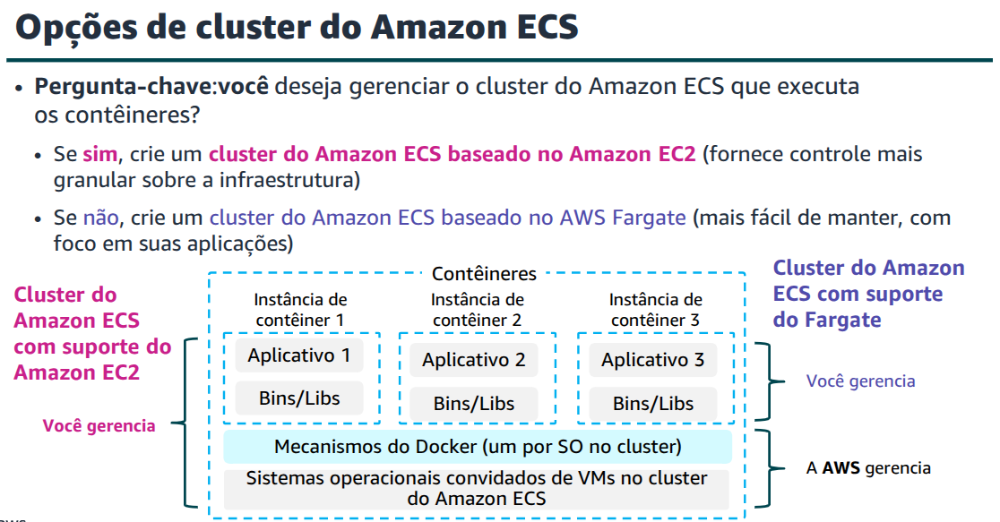

### Kubernetes
**Kubernetes** is an open source software for **container orchestration**.

It enables to deploy and manage containerized applications at scale.

Kubernetes manages a **cluster** of compute instances (called **nodes**).
It runs containers within the cluster.

Containers run in logical groupings called **pods**. You can run one or multiple containers together as a pod.

Each pod is assigned an IP address and a unique Domain Name System (DNS), which Kubernetes uses to connect its service to each other and external traffic.

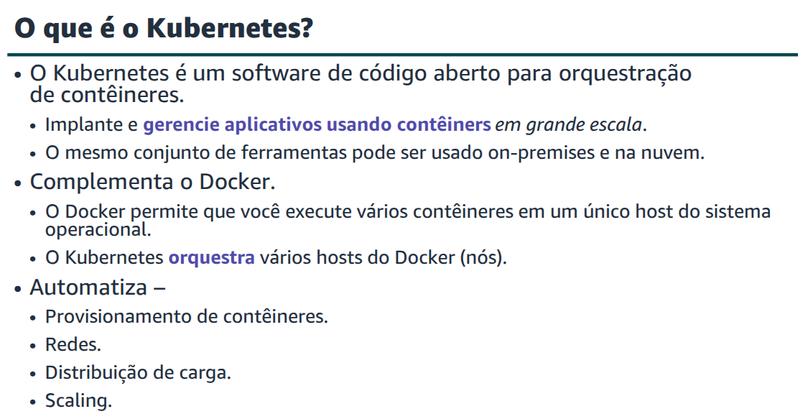

### Amazon Elastic Kubernetes Service (Amazon EKS)

### Amazon Elastic Container Registry (Amazon ECR)

## AWS Lambda
Serverless computing is an approach that does not require provisioning or managing servers.

**AWS Lambda** is an event driven **serverless compute** service.
It enables us to run code without provisioning or managing servers.

We create a **lambda function**, which is a AWS resource that contains the code we want to run.
Then, we trigger the lambda function, either on a schedule or in response to an event.
The code only runs when it is triggered.

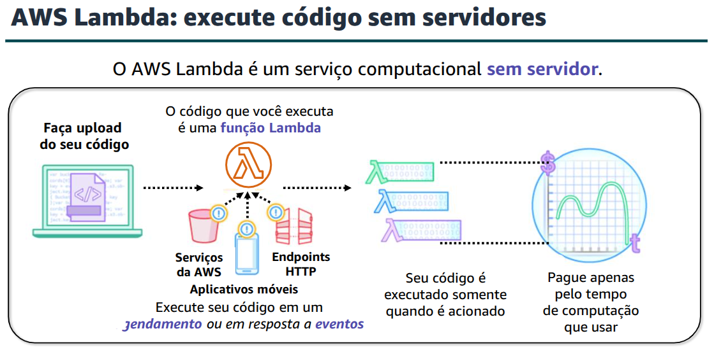

- Lambda supports **multiple programming languages**.

- Lambda **completely automates the administration**, managing the infrastructure to run your code.

- Lambda provides **built-in fault tolerance**. It mantains compute capacity across multiple avaliability zones.

- We can **orchestrate multiple lambda functions** for complex or long running tasks by building workflows with AWS Step Functions.

- Finally, with Lambda we **pay only for the requests that are served at the compute time that is required to run our code**.

### Event sources
Lambda functions are triggered by **event sources**.

An event source can be an AWS service or a developer created application that produces events that trigger the AWS Lambda function to run.

Some services, such as Amazon S3 and Amazon CloudWatch events, publish events to Lambda by **invoking the lambda function directly**.

Other services are **polled** by Lambda.

When creating a **Lambda function** we need to take some steps:
- First step is to give it a **name**.
- Then, we specify the **runtime environment**.
- Specify an **execution role** used to grand IAM permissions to the function so it can interact with other AWS services.

Then, we need to **configure** the function:
- Add a **trigger** which is where we specify an available event source
- Add **function code** using the code editor or uploading a file that contains the code.
- Specify the **memory** in MB to allocate to the function
- Optionally, we can specify environment variables, timeouts, specifics VPCs, tags and other settings.

All these settings are placed in a lambda deployment package, which is a zip archive that contains the function code and dependecies.
