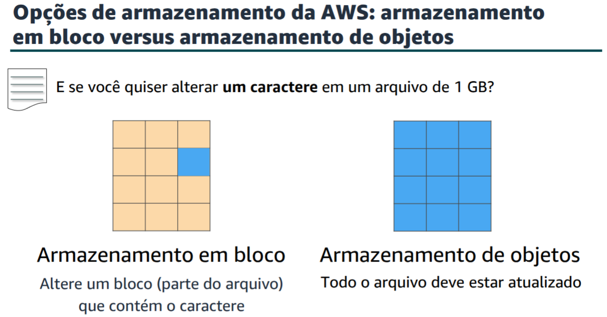
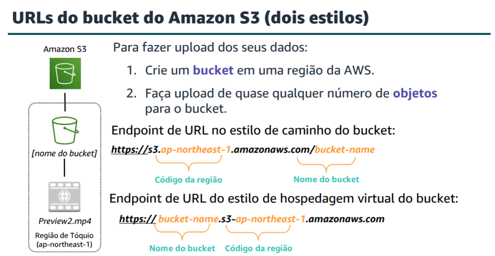
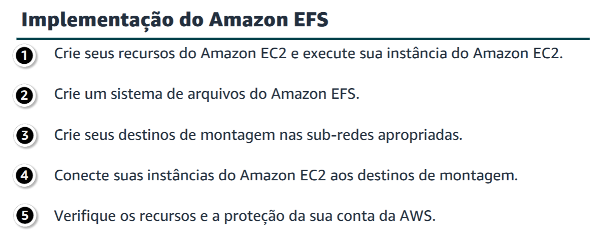
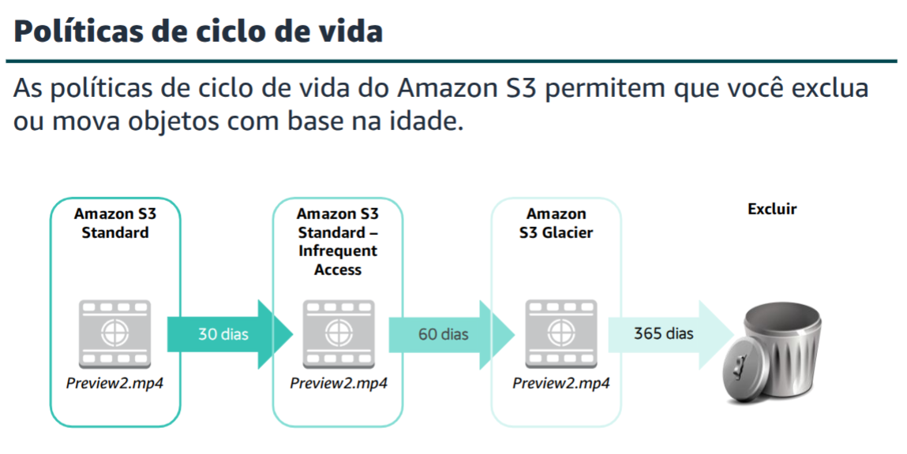

# Module 7 - Storage 

Storage Cateogories
- Instance 
## Amazon Elastic Block Store (Amazon EBS)
**Amazon EBS** provides **persistent block storage volumes** for use with Amazon EC2 instances.

**Persistent storage** is any data storage device that retains data after power is shut off. It is also called non-volatile storage

Each Amazon EBS volume is automatically replicated within it's availability zone.

This diagram illustrates the difference between **block storage** versus **object storage**.

Amazon EBS allows us to create individual storage volumes an attach them to an Amazon EC2 instance.
It offers durable and detachable (like an external hard drive) block storage to EC2 instances.

Because they are directly attach to the EC2 instance, they can provide low latency between where the data is stored and where it will be used.
This low latency makes EBS a good choice for running a database.

The **backup** of an Amazon EBS volume is called a **snapshot**.

The first snapshot is called the **baseline** snapshot.
Any other snapshot after the baseline captures only what is **different** from the previous snapshot.

Common use cases for Amazon EBS volumes:
- Boot volumes and storage for Amazon EC2 instances.
- File system for data storage.
- Database hosts
- Storage for enterprise applications.

## Amazon Simple Storage Service (Amazon S3)
**Amazon S3** is **object level storage**, which means that if we want to change a part of a file, we need to reupload the entire modified file.

S3 stores data as **objects** in resources that are called **buckets**.

Bucket names are universal and need to be unique across the world.

Ojbects can be up to **5 TB** in size.

We can use AWS IAM policies, Amazon S3 bucket policies and even per object Access Control Lists (ACL).

Amazon S3 includes event notifications that can be used to trigger other processes like AWS Lambda functions.

### Amazon S3 Storage Classes 
- **Amazon S3 Standard**: designed for availability, durability and performance for frequently accessed data.
- **Amazon S3 Intelligent-Tiering** designed to optimize cost by automatically moving data to the most cost effective access tier.
- **AmazonS3 Standard-InfrequentAccess (AmazonS3 Standard-IA)**: used for data that is accessed less frequently but requires rapid access when needed.
- **AmazonS3 OneZone-InfrequentAccess (AmazonS3 OneZone-IA)**: used for data that is accessed less frequently but requires rapid access when needed. Unlike other Amazon S3 classes which store data in a minimum of three Availability Zones, this class stores data in a single AZ and it cost less.
- **AmazonS3 Glacier**: secured, durable and low cost storage class for data archiving.
- **AmazonS3 Glacier Deep Archive**: the lowest cost storage class. Designed for data that is accessed once or twice a year.

### Buckets
**Buckets** are logical **containers** for objects. 

## Amazon Elastic File System (Amazon EFS)
**Amazon EFS** implements storage for EC2 instances that **multiple virtual machines can access** at the same time.

It is implemented as a shared file system that uses the Network File System (NFS)

## Amazon S3 Glacier
Amazon S3 Glacier is a secure, durable and low cost cloud storage service for data archiving and long term backup.

Data stored in Glacier can take several hours to retrieve. That's why it works well for archiving.

- **Archive**: any object stored in Amazon S3 Glacier.
- **Vault**: container for storing archives.
- **Vault Access Policy**: determines who can and can not access the data stored in the volume.

There are three options for retrieving data 

- **Expedited** retrievals are typically made available within 1 to 5 minutes and have the highest cost
- **Standard** retrievals typically complete within 3 to 5 hours and are less expensive than expedited.
- **Bulk** retrievals typically complete within 5 to 12 hours and are the least expensive.

### Lifecycle Policy

