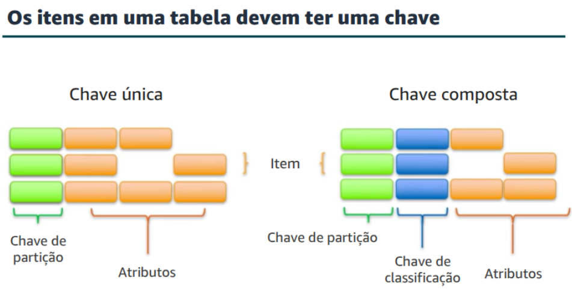
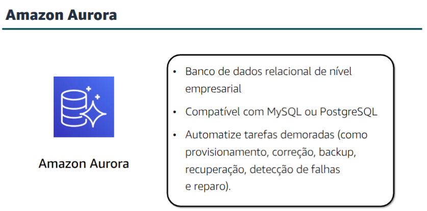

# Module 08 - Databases

## Amazon Relational Database Service (Amazon RDS)
**Amazon RDS** is a managed service that configurates and operates a **relational database** in the cloud.

The **Database Instance** is an isolated database environment that can contain multiple user created databases. 

## Amazon DynamoDB

Differences between relational database to non-relational databases

- A **Relational Database** (RDB) works with structure data that is organized by tables, records and columns. Think of tables as a spreadsheet with the rows being the records and the columns being the fields.
Relational databases creates relationship between tables so we can pull data from multiple tables with queries. RDBs uses Structure Query Language (SQL)
- A **Non-Relational Database** is any database that does not follow the relational model. They work with list of key-value pairs. They overcome the limitation of relational database for handling the demands of semistructure and unstructure data.

**DynamoDB** is a fast and flexible **NoSQL** database service.

We create tables and add items to the tables.
There is no practical limit on the number of items we can store in a table. 

Items in the same table can have different attributes. 
This gives the flexibility to add attributes as the application evolves.

### Core DynamoDB componentes
- **Table**: a collection of data
- **Items**: a group of attributes that is uniquely identifiable
- **Attribute**: fundamental data element in the table. 

### Keys
When creating a table, in addition to the table name, we must specify the **primary key** of the table. When adding, updating or deleting an item in the table, we need to specify the primary key attributes values for that item.

DynamoDB supports two different kinds of primary keys
- **Simple primary key** is an attribute that uniquely identifies an item. The attribute is called the **partition key**.
- **Composite primary key** is composed of two attributes. The first attribute is the partition key, and the second attribute is called the **sort key**.

## Amazon Redshift
**Amazon Redshift** is a fast fully managend **data warehouse** that makes simple and cost effective to analyse all your data by using standard SQL.

## Amazon Aurora
**Amazon Aurora** is a MySQL and PosgreSQL compatible relational database that is built for the cloud.

