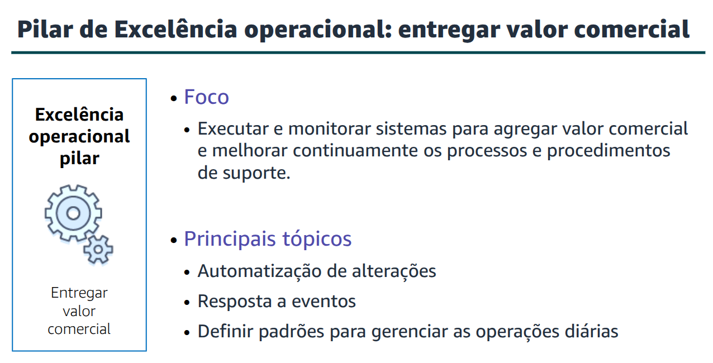
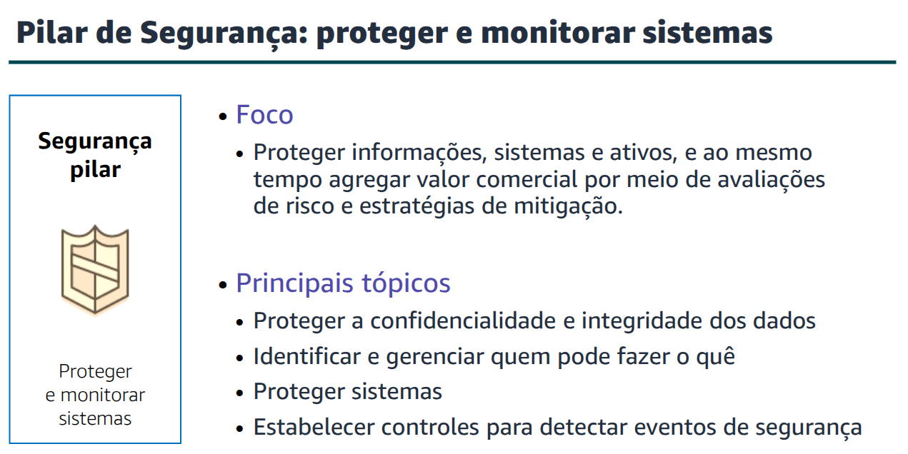
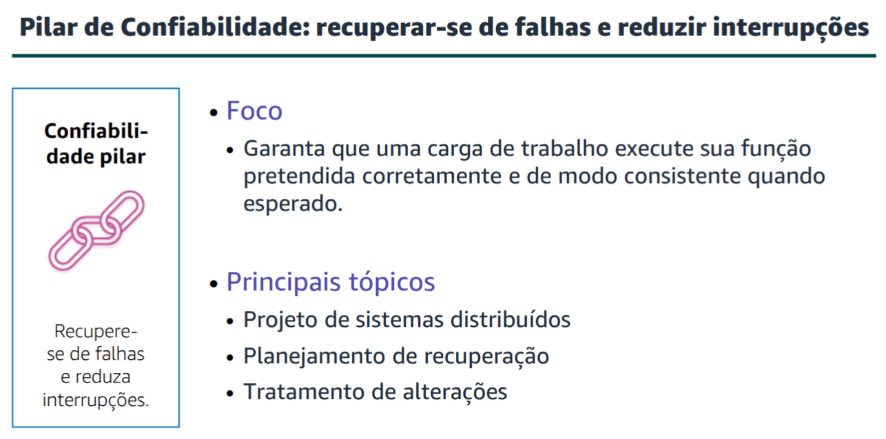
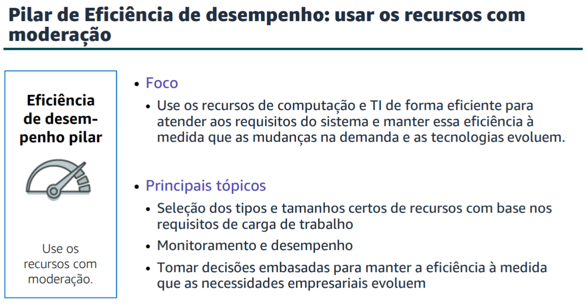
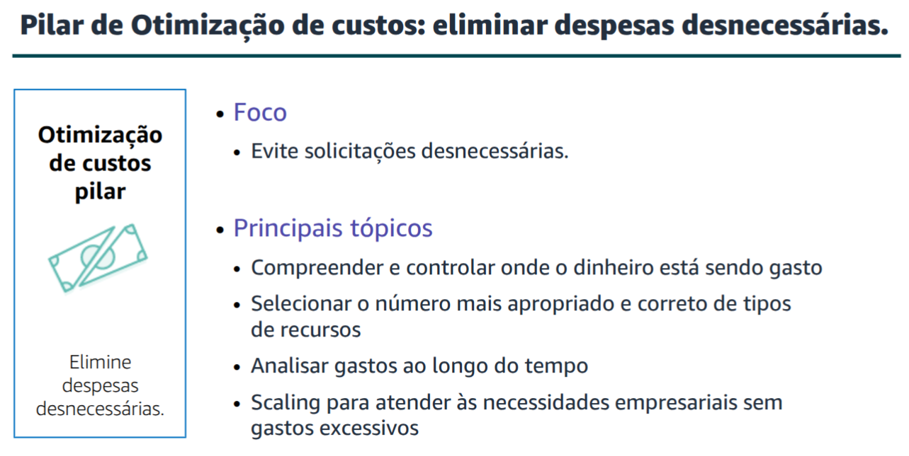
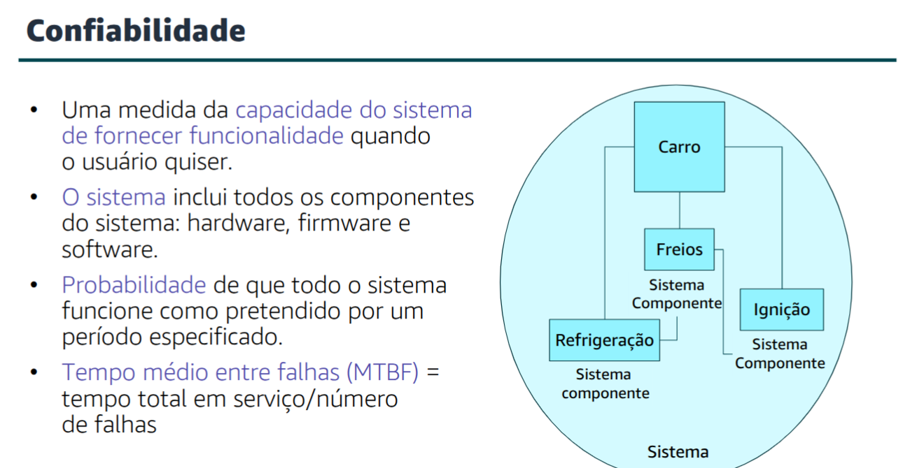
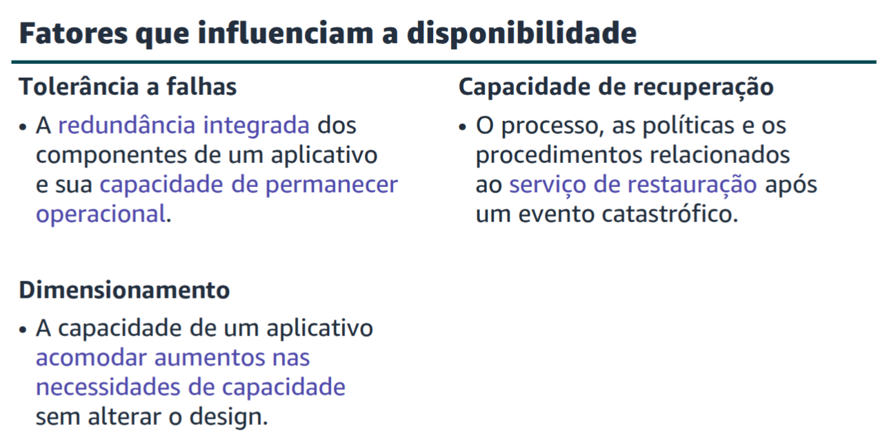
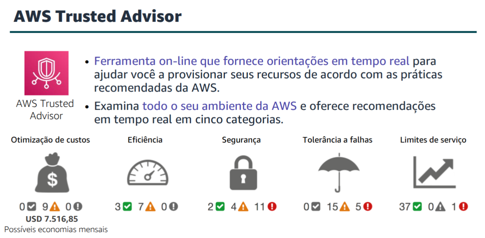

# Module 09 - Cloud Architecture

## AWS Well-Architected Framework
The framework is comprised of six pillars

### Operational Excellence Pillar

- Perform opperations as code
- Annotate documentation
- Make frequent, small, reversible changes
- Refine operations procedures frequently
- Antecipate failure
- Learn from operational events and failures

### Security Pillar

- Implement a strong identity foundation
- Enable traceability
- Apply security at all layers
- Automate security best practices
- Protect data in transit and at rest
- Keep people away from data
- Prepare for security events

### Reliability Pillar

- Test recovery procedures
- Automatically recover from failure
- Scale horinzontally to increase aggregate system availability
- Stop guessing capacity
- Manage change in automation

### Performance Efficiency Pillar

- Democratize advance tecnologies
- Go global in minutes
- Use serverless architectures
- Experiment more often 
- Have mechanical sympathy 

### Cost Optimization Pillar

- Adopt a consumption model
- Measure overall efficiency
- Stop spending money on datacenter operations
- Analyse and attribute expenditure
- Use managed and application level services to reduce cost of ownership

## Reliability

## Availability 

## AWS Trusted Advisor
