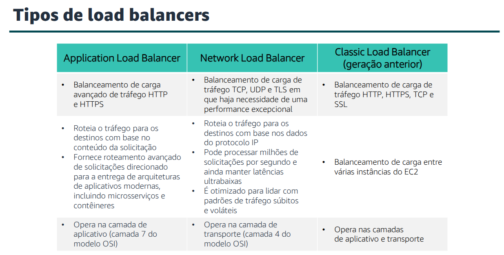
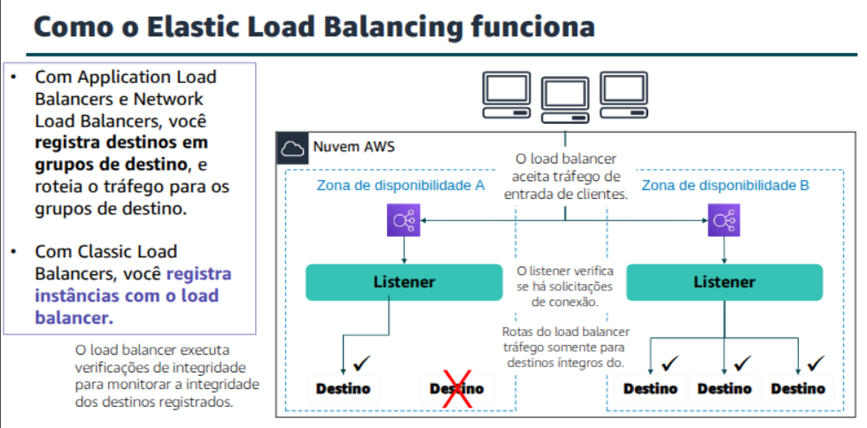
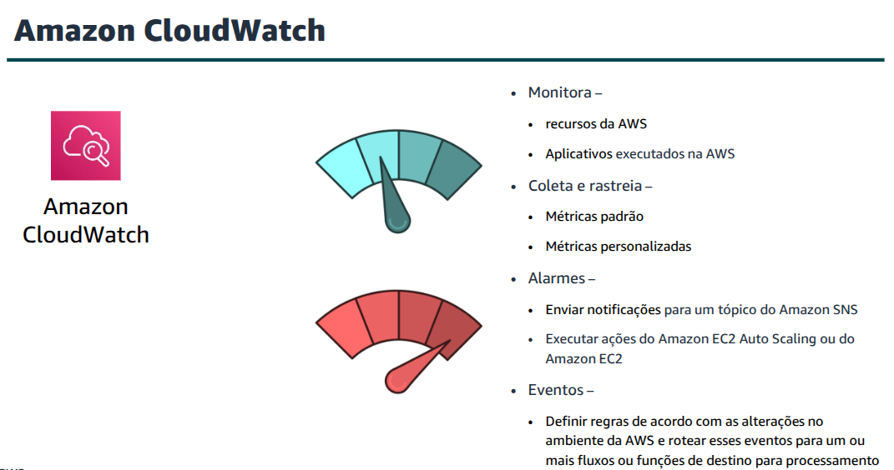
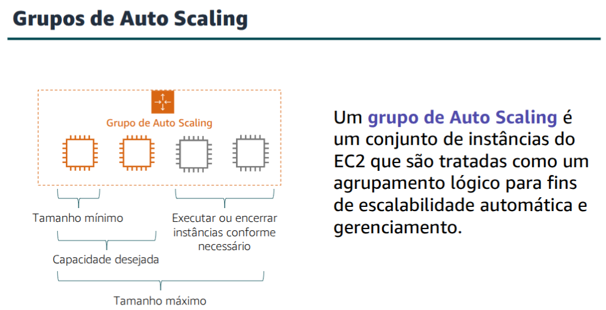
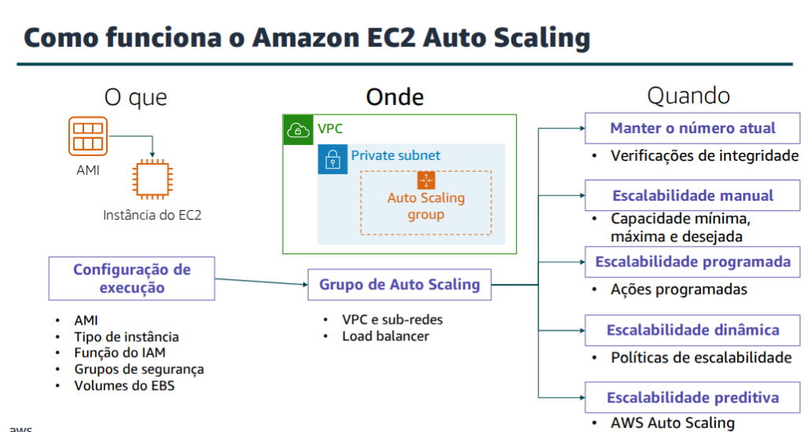

# Module 10 - Auto Scaling and Monitoring

## Elastic Load Balancing
**Elastic Load Balancing** is an AWS service that **distributes incoming traffic** across multiple targets such as EC2 instances, containers, IP addresses and Lambda functions, in a single Availability Zone or across multiple Availability Zones.

We configure the load balancer to accept incoming traffic by specifying one or more listeners.

A **listener** is a process that checks for connection requests.

It is configured with a protocol, like HTTP, and a port number, such as port 80.
Similarly, it is configured with a protocol and a port number for connections from the load balancers to the targets.

We can also configure the load balancer to perform health checks.

**Health checks** are used to monitor the health of the registered targets so that the load balancer only sends requests to the healthy instances.

Elastic Load Balancing use cases
- Achieve high availability and better fault tolerance for applications
- Enhance container support for Elastic Load Balancing
- Automatically scale applications.
- Use Elastic Load Balancing in the VPC
- Enable hybrid load balancing
- Call Lambda functions via HTTP(S)

## Amazon CloudWatch
**Amazon CloudWatch** is a **monitoring** and **observability** service. It monitors our AWS resources and the applications running on AWS in real time.

## Amazon EC2 Auto Scaling
Scaling is the hability to increase or decrease the compute capacity of our application.

**Amazon EC2 Auto Scaling** is an AWS service that helps maintain application availability and enables to **automatically add or remove EC2 instaces** according to specific conditions that can be defined.

An **Auto Scaling Group** is a collection of Amazon EC2 instances that are treated as a logical grouping. 

To launch EC2 instances, a Auto Scaling Group uses a **launch configurations** which is an instance configuration template.

